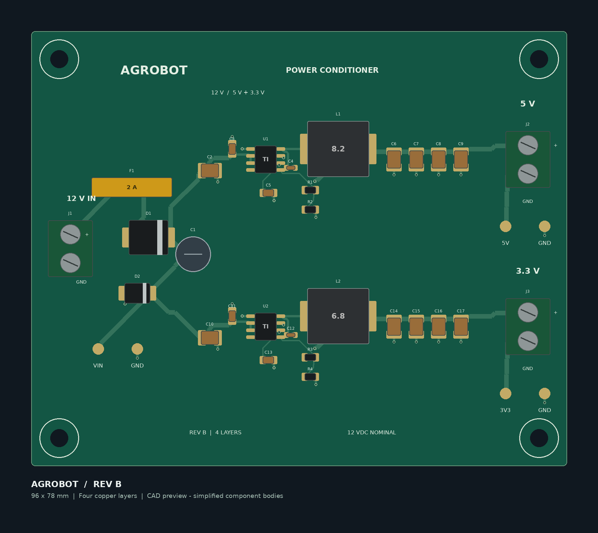

# Agrobot Power Board

Native KiCad schematic and four-layer PCB draft for a regulated 12 V input with separate 5 V and 3.3 V buck converters. Designed as a documented portfolio project; **not a fabrication release or tested hardware**.



## Open it

1. Install KiCad 9 or newer, including its standard applications.
2. Extract this entire ZIP. Keep the project and Libraries folder together.
3. Open `Agrobot_Power_Board.kicad_pro` in KiCad.
4. Open the schematic with the Schematic Editor button, or the board with the PCB Editor button.
5. In PCB Editor, press **B** to fill the ground zones, then save. If any load/parse error appears, stop and send a screenshot of the complete error.
6. Press **Alt+3** for KiCad's 3D viewer. Included 3D bodies are simplified representations, not manufacturer CAD models.

Ground zones have been defined but are delivered unfilled. Until step 5, ground connections will appear incomplete. The supplied images and PDF are authoring previews, not screenshots or exports from KiCad.

## Optional one-command local reports

Close the editors after saving. In Windows File Explorer, open this project folder, type `powershell` in the address bar, and press Enter. Run:

```powershell
powershell -NoProfile -ExecutionPolicy Bypass -File .\Local_Check.ps1
```

This process-only execution-policy option does not change your permanent PowerShell policy. Read the script first if you wish. It runs your installed KiCad CLI, exports the native schematic PDF, collects ERC/DRC reports, and attempts a native PCB render. It does not install anything, upload anything, or change your design files. You do not need to interpret the reports: send the resulting `Diagnostics_*.zip` back for review. Do not run it against unsaved editor changes.

If CLI auto-discovery fails, supply its path:

```powershell
.\Local_Check.ps1 -KiCadCli "C:\Program Files\KiCad\9.0\bin\kicad-cli.exe"
```

## Requirements and status

| Item | Target / implementation | Evidence status |
| --- | --- | --- |
| Input | Regulated 12 V DC, screw terminal | Nominal design input; not qualified for battery/automotive transients |
| 5 V output | 0.75 A continuous, 1.5 A peak | Design target; load and thermal testing pending |
| 3.3 V output | 0.5 A continuous, 1.0 A peak | Design target; load and thermal testing pending |
| Ripple | 20 mVpp / 10 mVpp respectively, 20 MHz bandwidth | Targets only; not simulated or measured |
| Protection | Resettable input fuse, reverse-polarity diode, TVS clamp | Component-level proposal; coordination review pending |
| Board | 96 x 78 mm, four copper layers, four 3.2 mm mounting holes | Native layout draft |
| Ground | Two internal planes plus outer-layer zones | Fill locally before native DRC |

The two LMR33630 converters use separate inductors, feedback networks, and output capacitors. No microcontroller or sensors are included: this is the Agrobot **power-conditioning board** only. Peak duration is unspecified; no guaranteed peak-duration capability is claimed.

## Contents

- `.kicad_pro`, `.kicad_sch`, `.kicad_pcb`: editable native project.
- `Libraries`: project-local symbols, footprints, simplified 3D models.
- `Documentation/BOM.md`: component list and procurement caveats.
- `Documentation/Schematic_Preview.pdf`: immediately viewable schematic preview.
- `Documentation/DESIGN_NOTES.md`: circuit choices, limitations, sources.
- `Documentation/AUTHORING_CHECKS.md`: checks performed outside KiCad.
- `Images`: illustrative top-board and routing previews.
- `Local_Check.ps1`: native KiCad export/report helper for Windows.

## Publishing on GitHub

Upload this folder's contents after reviewing the design. Keep the libraries and relative folder structure intact. The included `.gitignore` excludes local report runs and editor backups. You can deliberately add selected native PDFs, renders, and reviewed reports later.

An accurate project description is: "Developed a KiCad power-conditioning PCB draft for a 12 V input and 5 V/3.3 V outputs, with input protection and documented load/ripple targets. Fabrication and bench validation pending."

Do not describe the ripple or current targets as measured results, or this project as completed in Altium. AI-assisted authoring should be described accurately when relevant to portfolio or academic requirements.
